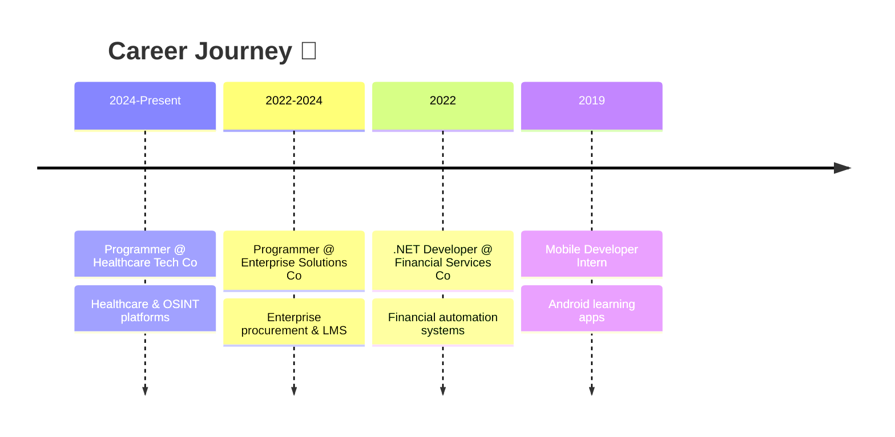

<div align="center">

<a href="https://www.gitanimals.org/en-US?utm_medium=image&utm_source=bratablessza&utm_content=line">
  
</a>


---

**Versatile Developer · Cat Enthusiast · Indonesia 🇮🇩**

[](https://linkedin.com/in/bratablessza)
[](https://bratablessza.github.io)
[](mailto:bratablessza@gmail.com)

</div>

---

```text
  ╱|、
 (˚ˎ 。7       "Code like a cat — deliberate, curious,
  |、˜〵                 and occasionally chaotic."
 じしˍ,)ノ
```

### 👋 About Me

Fullstack developer crafting robust systems and elegant interfaces. I thrive on finding real problems that need solving and building the right solution — whether it's a healthcare platform, an enterprise procurement system, or a WhatsApp chatbot powered by AI.

- 🔭 Currently building **enterprise web apps** at a healthcare technology company
- 🌱 Deep-diving into **AI/LLM integration** and **OSINT tooling**
- 🐈 I code best with a cat nearby (or at least a cat emoji)
- 🎵 When not coding: outdoor adventures, music, and photography

---

### 🛠️ Tech Stack

<details open>
<summary><b>Languages</b></summary>
<br>


</details>

<details open>
<summary><b>Frameworks & Libraries</b></summary>
<br>


</details>

<details open>
<summary><b>Databases</b></summary>
<br>


</details>

<details open>
<summary><b>Tools & Platforms</b></summary>
<br>


</details>

---

### 📊 GitHub Stats

<div align="center">
  
  
</div>

<div align="center">
  
</div>

---

### 💼 Experience



| When | Where | What |
|------|-------|------|
| **Jun 2024 – Now** | Healthcare Tech Co | Building healthcare platforms, OSINT tools, enterprise systems |
| **Oct 2022 – Jun 2024** | Enterprise Solutions Co | Procurement portal, parts management, disposal system, LMS platform |
| **Feb 2022 – Oct 2022** | Financial Services Co | Financial automation apps, legacy-to-modern migration, SQL optimization |
| **Jul 2019 – Sep 2019** | Local Kindergarten | Built Android mobile learning app for kindergarten students |

---

### 🎓 Education

- 🎓 **B.InfoSys** — Putra Indonesia University (2020)
- 🧑‍💻 **Java Fullstack Bootcamp** — Juara Coding (2021–2022)

---

<div align="center">

### 🐱✧･ﾟ: *✧･ﾟ:* ฅ^•ﻌ•^ฅ *:･ﾟ✧*:･ﾟ✧

*"In a world full of bugs, be a cat — land on your feet."*


</div>
